# 屏伴兔 · ScreenPal

<p align="center">
  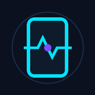
</p>

<p align="center">记录手机使用节奏，顺便养一只兔子</p>

<p align="center">
  <a href="https://github.com/t59688/PhonePulse/releases"></a>
  
  
  <a href="LICENSE"></a>
</p>

---

## 功能说明

### 森林里的家
- 熄屏期间兔子出门旅行，亮屏后带回礼物、趣闻、风景与明信片
- 家园可从空地逐步建造营地、地基、木屋
- 支持换装、摆家具、挂风景，以及分享家园 / 明信片

### 息屏间隔
- 记录上次熄屏到再次亮屏的间隔
- 在通知栏与首页展示（如「上次息屏：7 小时」）

### 通知栏计时
- 常驻显示「本次亮屏」「上次息屏」
- 亮屏前 1 分钟按秒刷新，之后按分钟刷新

### 屏幕使用统计
- 当日亮屏 / 熄屏总时长
- 唤醒次数、单次亮屏平均时长
- 24 小时活跃分布与状态明细列表

### 应用使用情况
- 按应用列出前台时长与启动次数
- 可选今日、昨日、近 7 天、近 30 天
- 支持进入单个应用查看时段分布

### 电量与亮熄屏
- 显示电量、电压、温度与实时电流
- 24 小时电量曲线，区分亮屏 / 熄屏耗电速度（%/h）
- 电池健康估算与充放记录

---

## 功耗与隐私

为了避免耗电，honePulse 尽量做到：

1. **少刷新**  
通知栏按需更新：亮屏未满 1 分钟时按秒刷新；满 1 分钟后改按分钟；熄屏后立刻停掉计时，不持 WakeLock，不挡系统 Doze。

2. **通知只显示一个时间单位**  
不满 60 秒写「XX秒」，满 1 分钟写「XX分」，再久写「XX小时」，不拼成「2分15秒」这种格式。

3. **数据只留在本地**  
屏幕记录和电量快照都在本机 Room / SQLite。没有统计 SDK，没有账号，也不上传。只有你主动检查更新时，才会访问 GitHub Releases。

---

## 界面预览

<p align="center">
  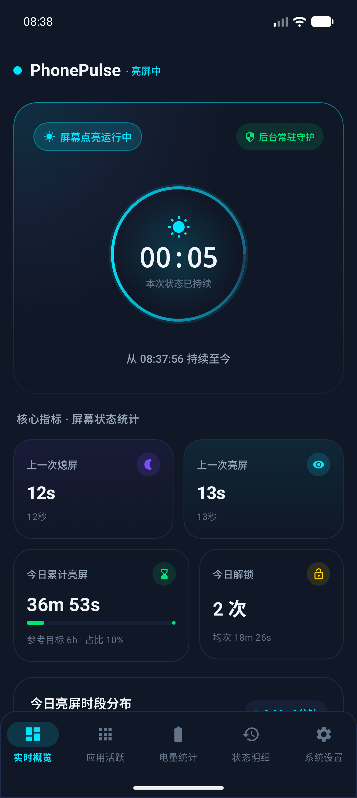
  &nbsp;&nbsp;
  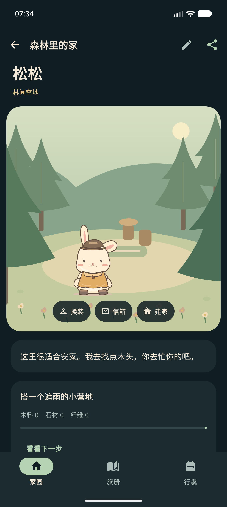
  &nbsp;&nbsp;
  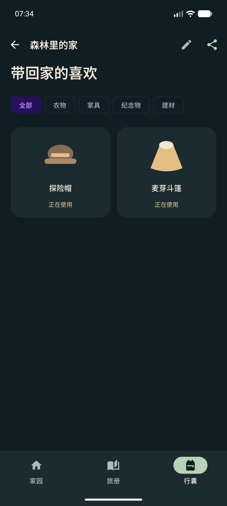
</p>
<p align="center">
  <sub>实时概览 · 森林家园 · 行囊</sub>
</p>

<p align="center">
  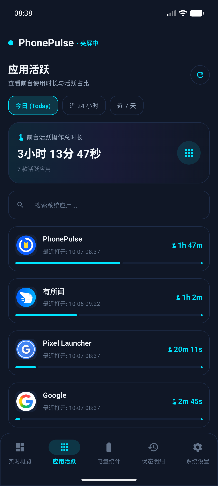
  &nbsp;&nbsp;
  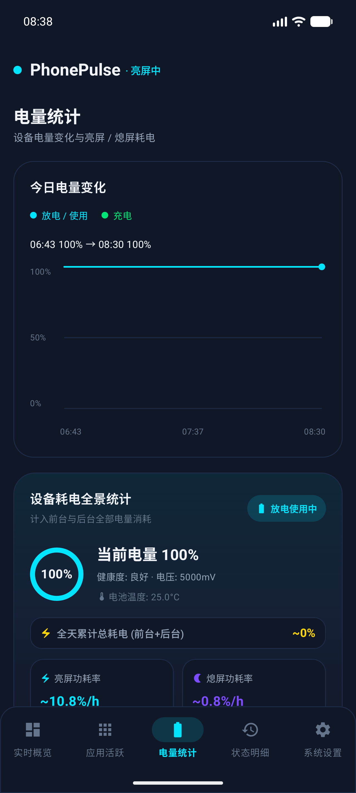
  &nbsp;&nbsp;
  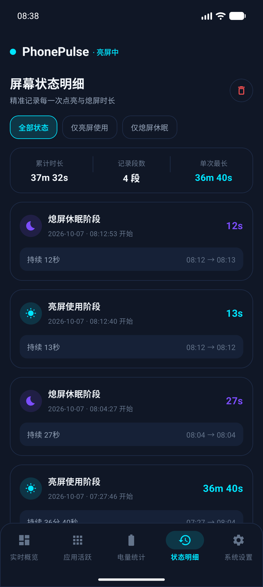
</p>
<p align="center">
  <sub>应用活跃 · 电量统计 · 状态明细</sub>
</p>

<p align="center">
  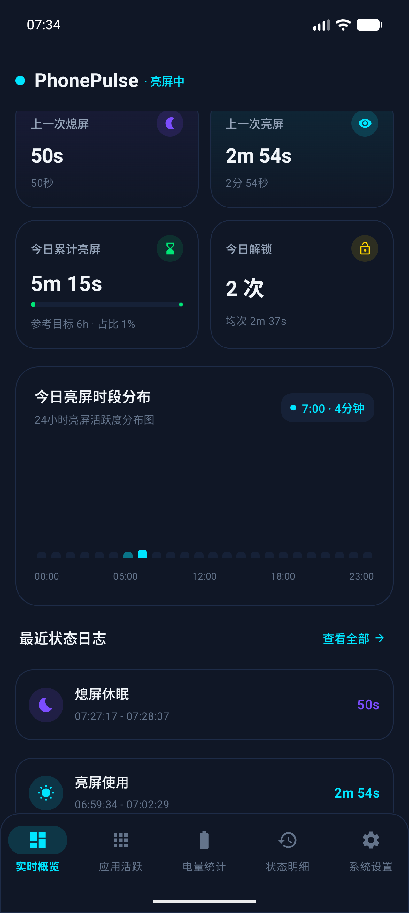
  &nbsp;&nbsp;
  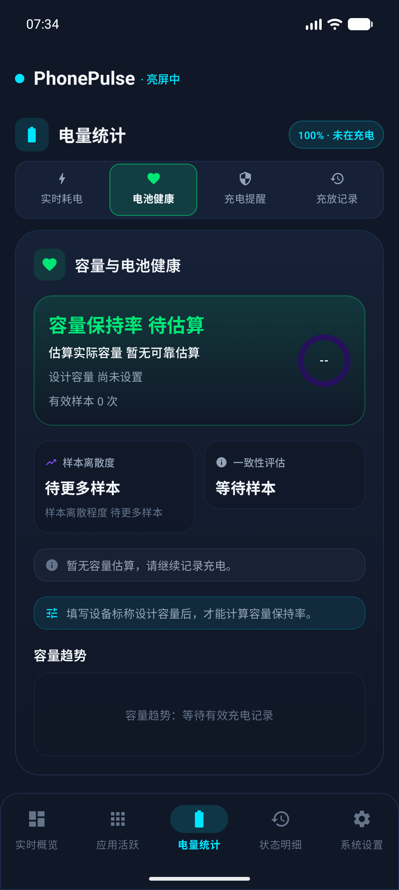
  &nbsp;&nbsp;
  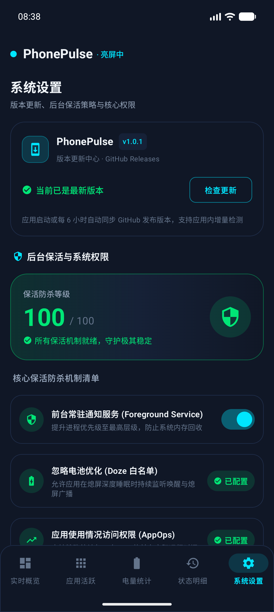
</p>
<p align="center">
  <sub>亮屏分布 · 电池健康 · 系统设置</sub>
</p>

<details>
<summary>更多界面</summary>
<br/>
<p align="center">
  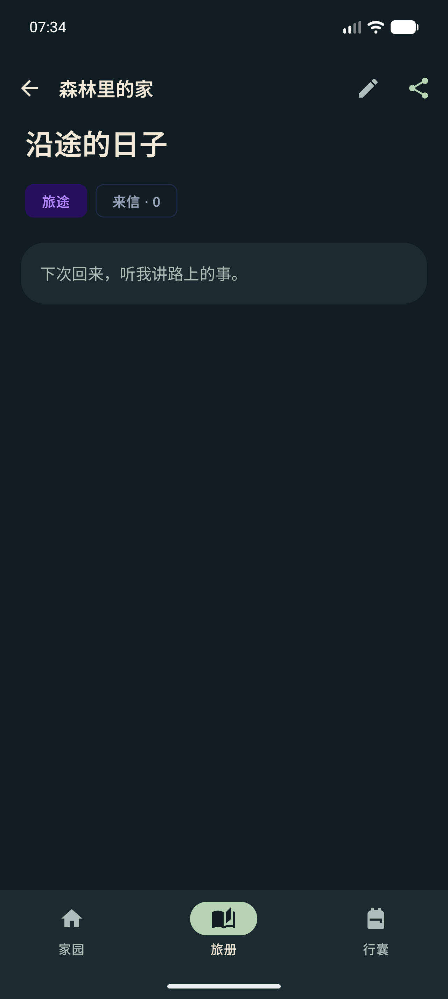
  &nbsp;&nbsp;
  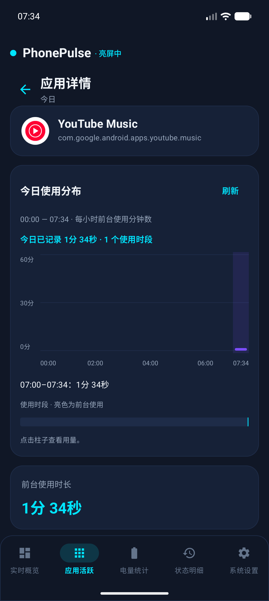
  &nbsp;&nbsp;
  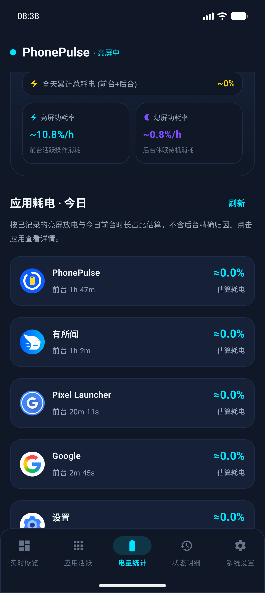
  &nbsp;&nbsp;
  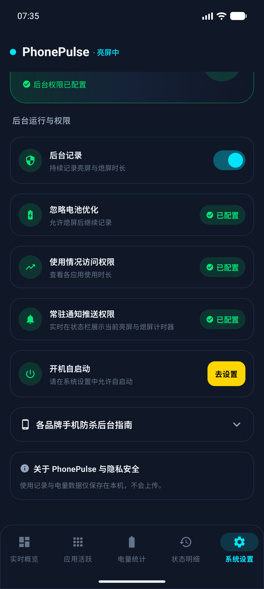
</p>
<p align="center">
  <sub>旅册 · 应用详情 · 电量续页 · 设置续页</sub>
</p>
</details>

### 板块说明

- **实时概览**：亮熄指示、核心指标、24 小时分布，以及进入森林伴侣的入口。
- **森林里的家**：家园建造、旅册明信片、行囊换装与收藏。
- **应用活跃**：各 App 前台时长排行，支持多日周期切换。
- **电量统计**：实时电流、电量曲线、电池健康与充放记录。
- **状态明细**：亮屏 / 熄屏历史，含起止时刻与持续时长。
- **系统设置**：更新检查、保活健康分、权限与厂商防杀指南。

---

## 技术架构

- 开发语言：Kotlin
- UI 框架：Jetpack Compose + Material 3（高对比度深色模式）
- 异步框架：Coroutines + StateFlow 响应式数据流
- 本地存储：Jetpack Room（SQLite）+ KSP
- 后台机制：Foreground Service（specialUse 类型）+ BroadcastReceiver
- 系统版本：支持 Android 7.0（API 24）及以上，目标适配 Android 16（API 36）

代码工程目录：

```
app/src/main/java/com/aizeek/phonepulse/
├── data/       本地 Room 数据库、DAO 访问层与数据仓库
├── receiver/   开机启动与系统广播监听
├── service/    屏幕状态监听服务、自适应通知与状态缓存
├── ui/         Compose 页面、组件、主题与 ViewModel
├── update/     GitHub Releases 检查与安全安装流程
└── util/       时间换算与系统保活辅助工具
```

---

## 本地构建与开发

编译环境要求：JDK 17 或 21，Android SDK（API 36）。

```bash
# 编译 Debug 安装包
./gradlew assembleDebug          # macOS / Linux
.\gradlew.bat assembleDebug      # Windows

# 选模拟器 / 设备并安装运行（Windows）
.\dev.bat

# 签名 Release（需配置 .env.android.local）
.\build-release.bat

# 运行单元测试
.\gradlew.bat testDebugUnitTest
```

Release 签名可在本地 `.env.android.local` 文件或系统环境变量中配置：
`KEYSTORE_PATH`、`STORE_PASSWORD`、`KEY_ALIAS`、`KEY_PASSWORD`。
如果推送到 GitHub，也可以通过打 `v*` 格式的 tag 触发 GitHub Actions 自动完成 Release 构建。

---

## 权限说明

为了在熄屏和锁屏状态下依然能够精准捕捉状态切换，应用声明了以下必要权限：

| 权限名称 | 用途说明 |
| --- | --- |
| `FOREGROUND_SERVICE` / `SPECIAL_USE` | 运行前台常驻服务，保障状态监听不被系统随意杀后台 |
| `POST_NOTIFICATIONS` | 在通知栏展示常驻的亮熄计时状态（Android 13+ 必需） |
| `REQUEST_IGNORE_BATTERY_OPTIMIZATIONS` | 申请加入电池优化白名单，防止熄屏深睡时广播被系统冻结 |
| `PACKAGE_USAGE_STATS` | 获取各应用前台活跃时长，用于生成应用使用榜单 |
| `RECEIVE_BOOT_COMPLETED` | 手机重启后自动恢复屏幕追踪服务，无需每次手动打开 |
| `INTERNET` | 仅在系统设置中检测或下载 GitHub Releases 的新版本时使用 |
| `REQUEST_INSTALL_PACKAGES` | 允许应用下载新版本后拉起系统安装器完成自更新 |

---

## 后台保活建议

在部分后台管控严格的定制系统（如 HyperOS、OriginOS、ColorOS、HarmonyOS 等）上，长时间熄屏待机后记录可能会被系统中断。建议在应用内“系统设置”页面参考提示进行配置：
1. 确保保活诊断健康分达到满分；
2. 在系统多任务界面中，将「屏伴兔 / ScreenPal」应用卡片进行“加锁”；
3. 在手机系统设置的“应用管理”中，允许本应用“自启动”并关闭“省电策略限制”。

---

## 参与贡献

欢迎提交 Issue 反馈问题或建议。如果想贡献代码：
1. Fork 本仓库并新建分支；
2. 提交修改并保证通过单元测试（`.\gradlew.bat testDebugUnitTest`）；
3. 提交 Pull Request 即可。

---

## 开源许可

本项目遵循 [Apache License 2.0](LICENSE) 协议开放源代码。

## 社区

感谢 [Linux.do](https://linux.do) 社区。